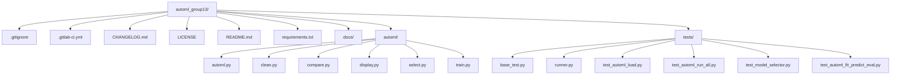

# AutoML Python Package

## Authors
- Maelig Pesantez (maelig.pesantez.Etu@univ-lemans.fr, @e2103064)
- Kilian Pousse (Kilian.Pousse.Etu@univ-lemans.fr, @s2200959)
- Belamri Arab (Arab.Belamri.Etu@univ-lemans.fr, @s2504495)

## Supervisor
- Aghilas Sini (Aghilas.Sini@univ-lemans.fr, @asini)
- Nicolas Dugue (Nicolas.Dugue@univ-lemans.fr, @ndugue)
- Theo Mariotte (Theo.Mariotte@univ-lemans.fr, @tmario)

## Project
**Methodology for Artificial Intelligence - Classical Methods for AI - DevOps, First Year of AI Master's, Le Mans University**

**Date:** October 2025

---

## Overview

**AutoML** is a Python package designed to automatically preprocess datasets, select the most appropriate machine learning model (regression or classification), and train it with minimal user intervention.

The package is modular:
- **`automl`**: Main orchestrator for data input, model selection, and training
- **`clean`**: Dataset cleaning and preprocessing utilities
- **`compare`**: Model performance comparison utilities
- **`display`**: Display utilities (metrics tables, plots, etc.)
- **`select`**: Automatic model selection logic
- **`train`**: Model training and evaluation pipeline

---

## Features

- **Automatic task type detection** (classification or regression)
- **Comprehensive data preprocessing** including cleaning and feature engineering
- **Modular architecture** for easy extension and customization
- **Minimal configuration** required for preprocessing and model training
- **Model performance comparison** with detailed metrics and visualizations
- **Automated model selection** based on dataset characteristics and performance
- **Compatible with various tabular datasets** in common formats
- **Extensive testing suite** ensuring reliability and stability
- **Comprehensive documentation** for easy integration and usage

---

## Installation

```bash
git clone https://git.univ-lemans.fr/e2103064/automl_group13.git
cd automl_group13
pip install -r requirements.txt
```

---

## Minimal package usage

```python
from automl.automl import AutoML

automl = AutoML()

# Training + evaluation
automl.fit("/path/to/data")
metrics = automl.eval()
print(metrics)

# Prediction on unseen data
preds = automl.predict("/path/to/data_test.data")
print(preds)
```

---

## Minimal CLI Usage

The AutoML package can be executed directly from the command line using the module syntax:

```bash
python -m automl.automl \
  --data /path/to/dataset.data \
  --solution /path/to/dataset.solution \
  --name dataset_name
```

Example of usage with provided dataset:

```python
python -m automl.automl \
  --data /Users/pyxis/Desktop/datasets/data_G/data_G.data \
  --solution /Users/pyxis/Desktop/datasets/data_G/data_G.solution \
  --name data_G
```

---

## Testing

Tests are implemented using `unittest`.

Run all tests:
```bash
python -m tests.runner 
```

Or run a specific test:
```bash
python3 -m unittest tests/test_model_selector.py
```

## Troubleshooting Tests

> ⚠️ Some tests can take several minutes depending on your hardware.

> ⚠️ Some test may generate acces violation warnings depending on OS (windows specially); these can be ignored.

> ⚠️ On very large datasets (such as data_F), `PicklingError` may occur when using parallel processing (`n_jobs=-1`) due to multiprocessing limitations on macOS/Linux shells.
This is not a bug in the AutoML code but a serialization issue from `joblib`.
The system automatically falls back to single-core mode (`n_jobs=1`) in such cases.

---

## Project Structure
```
automl_group13/
│
├── .gitignore                               # Git ignore file
├── .gitlab-ci.yml                           # Pipeline configuration file (not functionnal on university gitlab)
├── CHANGELOG.md                             # Changelog of the project to keep track of changes
├── LICENSE                                  # License of the project
├── README.md                                # You are here
├── requirements.txt                         # Required packages
├── docs/                                    # Documentation generated via Sphinx
│   └── article                              # Project article in LaTeX
│
├── automl/                                  # AutoML main package
│   │
│   ├── automl.py                            # Main orchestrator
│   ├── clean.py                             # Dataset cleaning utilities
│   ├── compare.py                           # Model comparison utilities
│   ├── display.py                           # Display utilities (metrics table, plots)
│   ├── select.py                            # Model selector
│   └── train.py                             # Model trainer
│
└── tests/                                   # Unit tests
    ├── base_test.py                         # Tests base class
    ├── runner.py                            # Modified test runner
    ├── test_automl_fit_predict_eval.py      # Test for package methods
    ├── test_automl_load.py                  # Test for automl module
    ├── test_automl_run_all.py               # Integration test for full AutoML run
    └── test_model_selector.py               # Test for model_selector module
```



---

## dotenv
The project uses a `.env` file to manage environment variables.
Create a `.env` file in the root directory with the following content:

```
DATASETS_DIR=/path/to/your/datasets
VERSION=1.0.0
```
---

## Documentation

AutoML documentation is available online → https://automl-group-13.netlify.app

To build it locally:

```bash
cd docs
make html
```

Generated documentation can then be viewed in your browser at `docs/_build/html/index.html`.

---

## Contributing

- Only members of the group can contribute.
- All contributions must follow the existing coding style and pass unit tests.

---

## Commit Conventions

```bash
<type>([<scope>]): <description>
```

| Type      | Description |
|-----------|-------------|
| feat      | Adding a new feature |
| fix       | Fixing a bug |
| docs      | Documentation changes |
| style     | Code style changes |
| refactor  | Code refactoring |
| perf      | Performance improvement |
| test      | Add or update tests |
| chore     | Maintenance tasks |
| ci        | Continuous Integration config changes |
| revert    | Revert a previous commit |
| release   | Release a new version |
| hotfix    | Critical bug fix |
| init      | Initial commit |

---

## License

Copyright (c) 2025 Maelig Pesantez, Kilian Pousse, Belamri Arab

Academic purposes only. Provided "AS IS", without warranty of any kind.

---

## Useful Links
- [Initial Project Description](https://umtice.univ-lemans.fr/pluginfile.php/1044534/mod_resource/content/1/projet_MachineLearningChallenge_M1INFO_IA.pdf)
- [Documentation](https://automl-group-13.netlify.app)

---

## Contact

| Role        | Name            | Email                               | Identifier   |
|--------------|----------------|-------------------------------------|--------------|
| Developer    | Maelig Pesantez | maelig.pesantez.Etu@univ-lemans.fr | @e2103064    |
| Developer    | Kilian Pousse   | Kilian.Pousse.Etu@univ-lemans.fr   | @s2200959    |
| Developer    | Belamri Arab    | Arab.Belamri.Etu@univ-lemans.fr    | @s2504495    |
| Supervisor   | Aghilas Sini    | Aghilas.Sini@univ-lemans.fr        | @asini       |
| Supervisor   | Nicolas Dugue   | Nicolas.Dugue@univ-lemans.fr       | @ndugue      |
| Supervisor   | Theo Mariotte   | Theo.Mariotte@univ-lemans.fr       | @tmario      |

